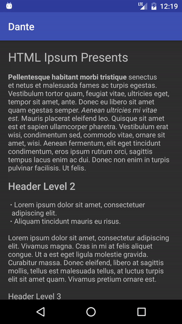

# Dante

Dante is a text parser to easily generate a `Spannable` from a raw input, right now it supports only HTML but the idea is to be able to support multiple input types (e.g., MarkDown).

Originally I authored Dante in [Pause](http://pause.fm), the project is now dead and I decided to open source it.

This is the very first release of Dante, the api will (most likely) change for the better with successive iterations.



## Installation

Simply add the following to your `build.gradle`:

```
repositories {
  jcenter()
}

dependencies {
  compile 'com.fourlastor:dante:1.0.1'
}
```

## Usage with HTML

```java
FlavoredHtml flavoredHtml = new FlavoredHtml.Builder(context)
  .newLine("p", "h1", "h2", "h3", "h4", "h5", "h6", "li")
  .textAppearance(R.style.headline, "h1")
  .textAppearance(R.style.title, "h2")
  .textAppearance(R.style.subhead, "h3")
  .textAppearance(R.style.body, "p", "li")
  .style(Typeface.BOLD, "b", "strong")
  .style(Typeface.ITALIC, "i", "em")
  .bullet(15, "li")
  .build();

Spanned styledHtml = flavoredHtml.parse(htmlString);
```

Keep in mind that this will be executed on the same thread on which `flavoredHtml.parse()` is executed. Since loading images might entail executing network requests, make sure you invoke `flavoredHtml.parse()` outside of the main thread if you are also loading images.

## Loading images

You'll have to implement either `ImgLoader` to load images, if you need to load bitmaps (e.g., from the network) you can use `ImgLoader.BitmapLoader`:

```java
FlavoredHtml flavoredHtml = new FlavoredHtml.Builder(context)
  .img(new ImgListener.BitmapImgGetter(getResources()) {
                      @Override
                      protected Bitmap getBitmap(String src) {
                          try {
                              return Picasso.with(MainActivity.this)
                                      .load(src)
                                      .get();
                          } catch (IOException e) {
                              throw new RuntimeException("Whoops!");
                          }
                      }
                  });
```

Keep in mind that this will be executed in the same thread in which `flavoredHtml.parse()` is executed, if you wish to execute network requests, do so invoking `flavoredHtml.parse()` outside of the main thread.

## Different input types

As long as you implement `Parser`, it shouldn't be hard to support a different text style, see `HtmlParser`'s implementation as a reference.


